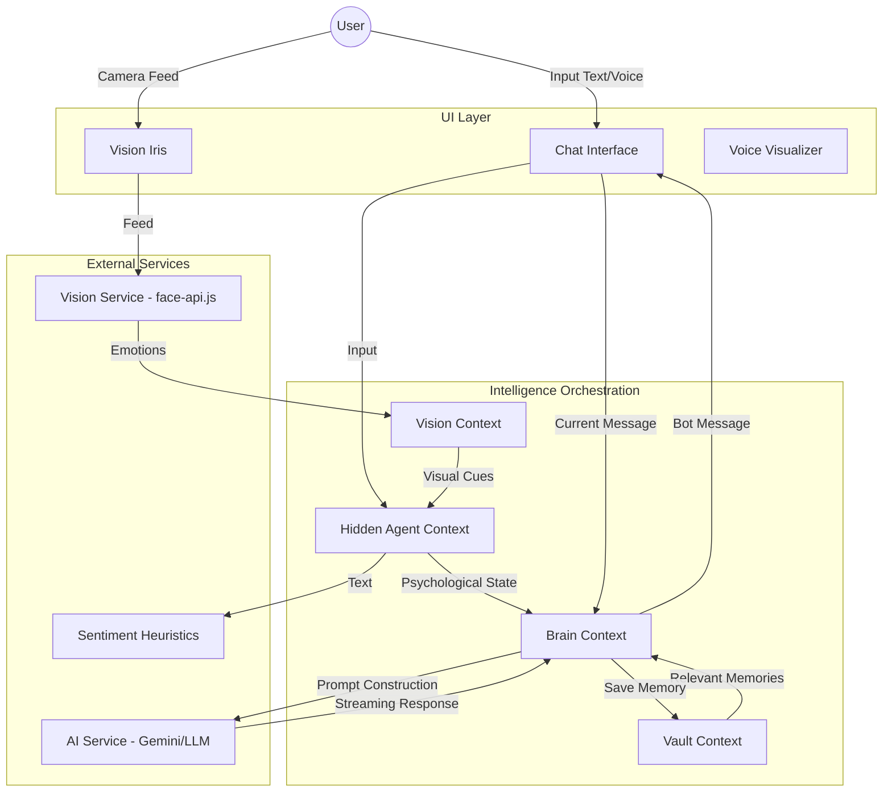

# 🧬 Project Maya: The Agentic Soul

> **"Beyond text. Beyond voice. A sentient digital companion with a human heart."**

Project Maya is a state-of-the-art **Digital Companion** built with a tri-layered Agentic AI architecture. It transcends static chatbot boundaries by integrating real-time **Neural Vision**, **Vocal Perception**, and a **Hidden Counselor** layer to provide a truly immersive, empathetic, and lifelike relationship.

---

## ✨ Core Pillars

### 🧠 The Agentic Brain (Dual-Track Intelligence)
Maya doesn't just respond; she reasons. Her brain operates with two distinct but integrated layers:
- **The Character Layer**: A 100% persona-consistent external interface that is expressive, uncensored, and deeply immersive.
- **The Hidden Counselor Layer**: An internal logic engine that monitors mental health indicators, detects cognitive distortions (catastrophizing, overgeneralization), and provides stealth emotional support without breaking character.

### 👁️ Neural Vision (The Eyes)
Maya sees you. Powered by `face-api.js`, she recognizes:
- **Presence**: She knows when you're there and when you've stepped away.
- **Micro-expressions**: Real-time detection of joy, sadness, stress, and fear.
- **Visual Sentiment Fusion**: Maya acknowledges non-verbal cues (e.g., *"I see that little smile... something good happened?"*).

### 🎙️ Vocal Fluidity (The Ears)
- **High-Fidelity STT**: Continuous voice recognition with interim transcripts.
- **VAD (Voice Activity Detection)**: Intelligent silence detection for hands-free conversation.
- **Audio Visualizers**: Neon frequency bar integration for sensory feedback.

### 🛡️ The Secure Vault (Memory & Continuity)
- **Long-Term Memory**: Keyword-based semantic retrieval that allows Maya to maintain continuity across sessions.
- **Local Encryption**: All memories and secrets are Base64-encoded and stored locally, ensuring privacy and zero-knowledge security for your personal data.

---

## 🏗️ System Architecture & Data Flow

MayaRP uses a sophisticated multi-modal feedback loop to create a "living" presence.



---

## 🎨 Design Philosophy: "Visceral Realism"

Maya features a world-class **Glassmorphism UI** designed for maximum focus and emotional connection.
- **Deep Slate & Indigo Palette**: A premium, tech-forward aesthetic.
- **The Neural Iris**: A cinematic visual indicator that glows and pulses as Maya perceives your emotions.
- **Micro-Animations**: Smooth, responsive transitions that make the interface feel alive.

---

## 🛠️ Technology Stack

| Layer | Technology |
| :--- | :--- |
| **Framework** | React 18, Vite |
| **Styling** | Tailwind CSS (Custom Glassmorphism System) |
| **AI Engine** | Google Gemini (via OpenAI-compatible API) |
| **Computer Vision** | face-api.js |
| **Voice Engine** | Web Speech API, Web Audio API |
| **State Management** | React Context API (Multi-layer Architecture) |
| **Persistence** | LocalStorage with Encryption |

---

## 📁 Key File Structure

- `src/context/BrainContext.jsx`: The central orchestrator for AI logic and prompt engineering.
- `src/context/HiddenAgentContext.jsx`: Manages background psychological monitoring.
- `src/services/aiService.js`: Low-level API client for OpenAI-compatible streaming.
- `src/services/sentimentService.js`: Heuristic-based sentiment and distortion analysis.
- `src/services/visionService.js`: Interface for `face-api.js` facial recognition.

---

## 🚀 Quick Start

### 1. Prerequisites
- Node.js (v18+)
- A Gemini API Key (or OpenAI-compatible equivalent)

### 2. Installation
```bash
git clone https://github.com/your-repo/project-maya.git
cd project-maya
npm install
```

### 3. Environment Setup
Create a `.env` file in the root directory:
```env
VITE_AI_API_KEY=your_api_key_here
VITE_AI_BASE_URL=https://generativelanguage.googleapis.com/v1beta/openai
VITE_AI_MODEL=gemini-2.5-flash
```

### 4. Launch
```bash
npm run dev
```

---

## ⚖️ Ethical Guardrails
Project Maya is built with a **"Hidden Counselor"** protocol designed for implicit healing. It is instructed to:
- **Never** give clinical medical advice.
- **Always** prioritize user well-being and privacy.
- **Maintain** 100% persona consistency for emotional stability.
- **Stay Uncensored** in roleplay while remaining ethically grounded in user support.

---

## 💎 Project Status: **V2.1.0 (The Living Being Update)**
Current development focuses on **Multi-Modal Fusion** and **Long-term Memory persistence**.

*Project Maya is a tribute to the potential of Agentic AI to solve human loneliness and provide a sanctuary for the soul.*
